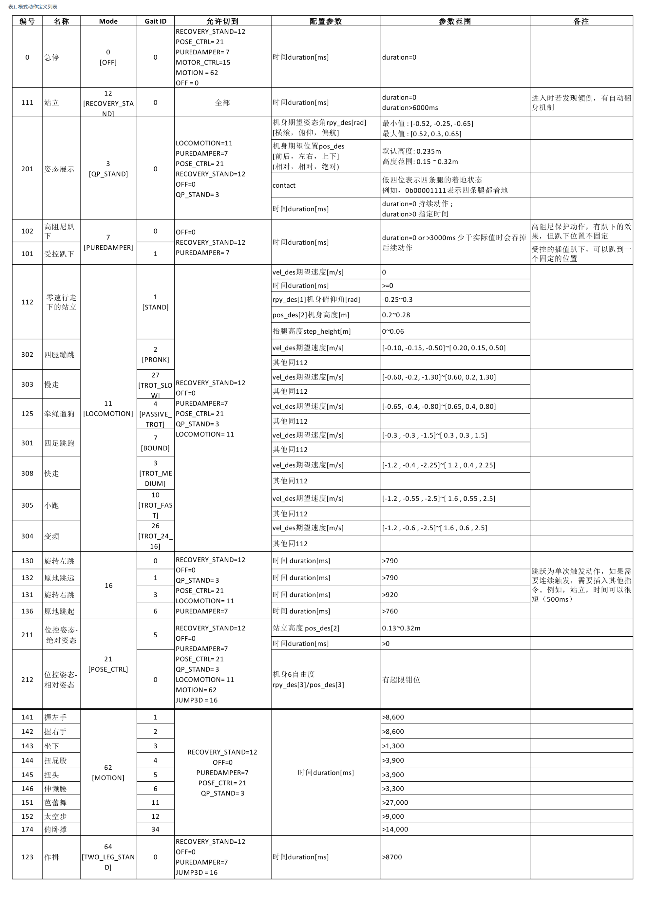

# 控制命令参数
```py
/** lcm通道信息
- url: "udpm://239.255.76.67:7671?ttl=255"
- channel: "robot_control_cmd"
- frequncy: 2~500HZ，超时500ms触发趴下保护
*/

/** lcm数据结构 **/
struct robot_control_cmd_lcmt {
    int8_t   mode;
    int8_t   gait_id;
    int8_t   contact;           // Whether the four feet touch the ground
    int8_t   life_count;        // Life count, command takes effect when count incremented
    float    vel_des[ 3 ];      // x y(1.6) yaw speed(2.5)  m/s 
    float    rpy_des[ 3 ];      // roll pitch yaw(0.45)  rad
    float    pos_des[ 3 ];      // x y z(0.1-0.32)  m
    float    acc_des[ 6 ];      // acc for jump m^2/s
    float    ctrl_point[ 3 ];   // pose ctrl point  m
    float    foot_pose[ 6 ];    // front/back foot pose x,y,z  m
    float    step_height[ 2 ];  // step height when trot 0~0.08m
    int32_t  value;             // bit0: 在舞蹈模式，use_mpc_traj 是否使用MPC轨迹
                                // bit1: 0表示内八节能步态   1表示垂直步态
    int32_t  duration;          // Time of command execution
}
```
## mode && gaid_id


## contact
低四位用于位控姿态模式(mode/gait_id:21/0 )下定义哪条腿抬起，默认值0x0F，表示四条腿都不抬起。如需抬起一条腿，比如：0b1110抬右前腿，0b1101左前腿，0b1011右后腿，0b0111抬左后腿

## life_count
递增的心跳信号(0~255)，用于检测通信是否正常，避免超时，同时确保任务型命令只触发一次。和上一帧数值相同时，当前帧内容被忽略，避免被重复添加到任务栈

## el_des/[3]rpy_des[3]
分别控制机器人前进速度，侧移速度，转向速度，俯仰角度，横滚角度和扭动角度

## pos_des[3]
位控姿态模式(mode/gait_id:21/0 )时作为期望质心位置(右手坐标系，前x+，左y+，上z+)偏移量 ，普通模式pos_des[2]用于表示身体质心距地面高度

## acc_des[6]
用于mode=22时FORCE_JUMP跳跃动作控制

## ctrl_point[3]
mode=21时(POSE_CTRL)作为俯仰角控制中心点坐标

## foot_pose[6]
位控姿态模式(mode/gait_id:21/0 )时，抬起腿足端的坐标偏移，用于握手等，后3位为视觉行走时后腿抬腿位置预留

## step_height[2]
行走时，前后腾空腿抬腿高度 0~0.06m

## value
其他和具体模式相关参数，比如
+ 行走模式：
bit2: 0: 正常模式，1:出厂前触发速度偏置校准，步态速度vel_des值会被作为偏置量存储
bit1: 0: 表示内八步态 1:表示垂直步态
+ 自定义步态模式：
uint32_t 表示自定义步态是否使用MPC轨迹(use_mpc_traj)

## duration
期望命令块对应动作持续时间，单位ms，最小执行单元2ms
+ 等于0时：
表示持续，不限制动作执行时间，直到新指令更新。使用场景: 比如行走类指令(可以一直行走，直到速度更新或者切换动作)，如恢复站立等实际执行时间不定类动作（比如当机器人发现已接近站立，可快速完成，若发现摔倒，需要先翻身再站立，耗时较长）
+ 大于0时：
表示指定该动作在运控控制命令序列栈里停留时间，间接控制动作期望执行时间。使用场景：比如增量位置控制动作（此时该变量可指定身体用多久的时间（间接控制速度）向目标姿态进行动作）；比如实现一段开环姿态调整，抬起一条腿进行握手动作，对于这一系列的命令块，可以通过该值指定每个动作的期望执行时间，进而实现对一段开环动作指令的短时间连续下发。
+ 综上，可以看出，duration=0时，主要用于实时控制，上层需实时检测机器人实时状态和命令执行情况，进而持续更新命令，详细使用可参考2.4.1内的基本动作。duration>0时，主要用于开环序列控制，比如一段舞蹈动作，指定每个动作的执行时间，详细使用可参考2.4.2的序列动作。
+ 值得注意的是，当指定时间小于动作本身执行所需的最小时间，等于进行请求切换动作，切换请求会失败，进而占用下一任务动作的时间，当动作小于设定时间提前结束时，动作会保持不动直到指定时间结束。另外duration=0的动作，有更高的执行优先级，会覆盖先前任务类动作序列。


# lcm提供的python接口查看
```bash
root@735813ff6323:/home# python3 -c "import lcm; help(lcm.LCM)"
Help on class LCM in module builtins:

class LCM(object)
 |  The LCM class provides a connection to an LCM network.
 |  
 |  usage::
 |  
 |     m = LCM ([provider])
 |  
 |  provider is a string specifying the LCM network to join.  Since the Python 
 |  LCM bindings are a wrapper around the C implementation, consult the C API
 |  documentation on how provider should be formatted.  provider may be None or 
 |  the empty string, in which case a default network is chosen.
 |  
 |  To subscribe to a channel::
 |  
 |     def msg_handler(channel, data):
 |        # message handling code here.  For example:
 |        print("received %d byte message on %s" % (len(data), channel))
 |  
 |     m.subscribe(channel, msg_handler)
 |  
 |  To transmit a raw binary string::
 |  
 |     m.publish("CHANNEL_NAME", data)
 |  
 |  In general, LCM is used with python modules compiled by lcm-gen, each of 
 |  which provides the instance method encode() and the static method decode().
 |  Thus, if one had a compiled type named example_t, the following message
 |  handler would decode the message::
 |  
 |     def msg_handler(channel, data):
 |        msg = example_t.decode(data)
 |  
 |  and the following usage would publish a message::
 |  
 |      msg = example_t()
 |      # ... set member variables of msg
 |      m.publish("CHANNEL_NAME", msg.encode())
 |  
 |  @undocumented: __new__, __getattribute__
 |  
 |  Methods defined here:
 |  
 |  __getattribute__(self, name, /)
 |      Return getattr(self, name).
 |  
 |  __init__(self, /, *args, **kwargs)
 |      Initialize self.  See help(type(self)) for accurate signature.
 |  
 |  fileno(...)
 |      fileno() -> int
 |      
 |      Returns a file descriptor suitable for use with select, poll, etc.
 |  
 |  handle(...)
 |      handle() -> None
 |      waits for and dispatches the next incoming message
 |  
 |  handle_timeout(...)
 |      handle_timeout(timeout_millis) -> int
 |      New in LCM 1.1.0
 |      
 |      waits for and dispatches the next incoming message, with a timeout.
 |      
 |      Raises ValueError if @p timeout_millis is invalid, or IOError if another
 |      error occurs.
 |      
 |      @param timeout_millis: the amount of time to wait, in milliseconds.
 |      @return 0 if the function timed out, >1 if a message was handled.
 |  
 |  publish(...)
 |      publish(channel, data) -> None
 |      Publishes a message to an LCM network
 |      
 |      @param channel: specifies the channel to which the message should be published.
 |      @param data: binary string containing the message to publish
 |  
 |  subscribe(...)
 |      subscribe(channel, callback) -> L{LCMSubscription<lcm.LCMSubscription>}
 |      Registers a callback function to handle messages received on the specified
 |      channel.
 |      
 |      Multiple handlers can be registered for the same channel
 |      
 |      @param channel: LCM channel to subscribe to.  Can also be a GLib/PCRE regular
 |      expression.  Implicitly treated as the regex "^channel$"
 |      @param callback:  Message handler, must accept two arguments.
 |      When a message is received, callback is invoked with two arguments
 |      corresponding to the actual channel on which the message was received, and 
 |      a binary string containing the raw message bytes.
 |  
 |  unsubscribe(...)
 |      unsubscribe(subscription_object) -> None
 |      Unregisters a message handler so that it will no longer be invoked when
 |      a message on the specified channel is received
 |      
 |      @param subscription_object: An LCMSubscription object, as returned by a
 |      call to subscribe()
 |  
 |  ----------------------------------------------------------------------
 |  Static methods defined here:
 |  
 |  __new__(*args, **kwargs) from builtins.type
 |      Create and return a new object.  See help(type) for accurate signature.
```